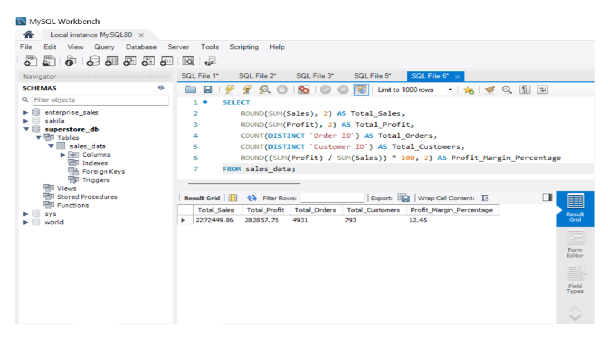
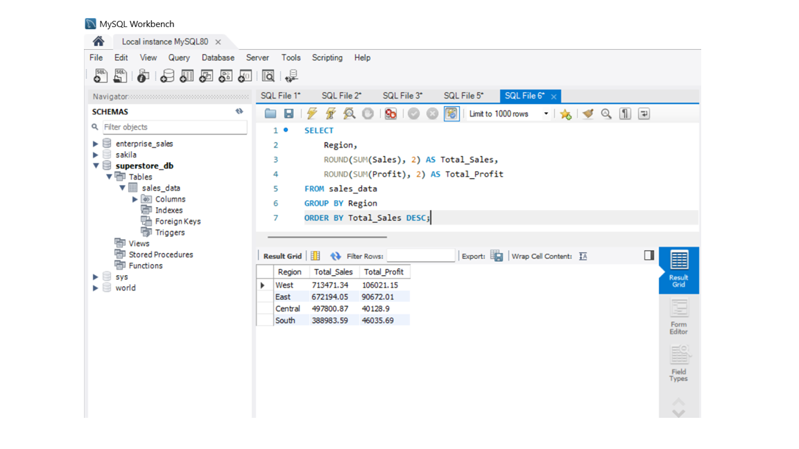
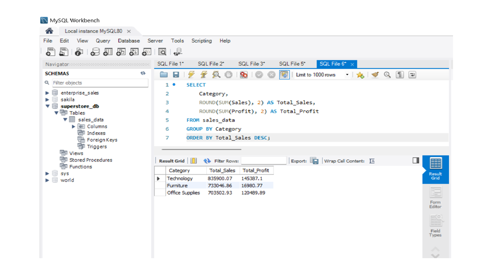
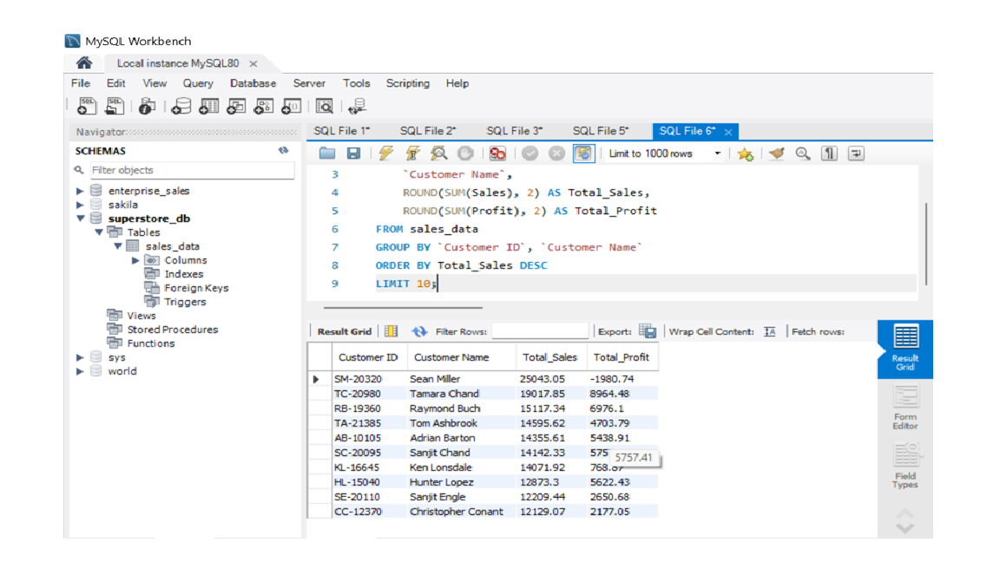
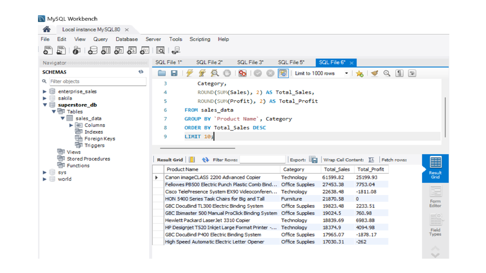
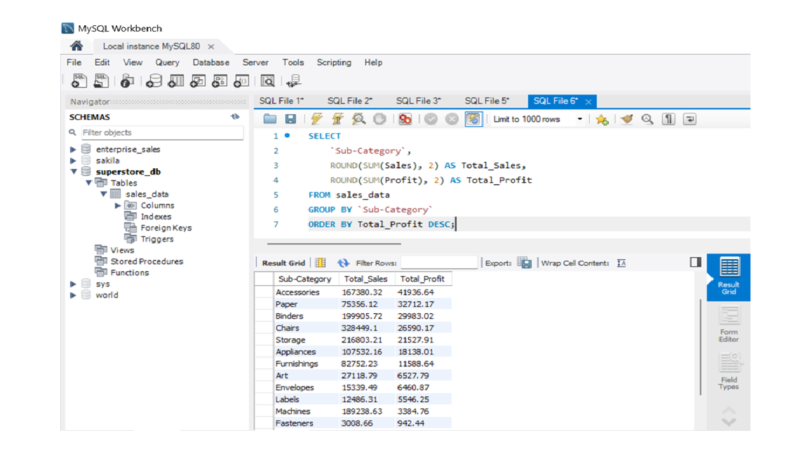
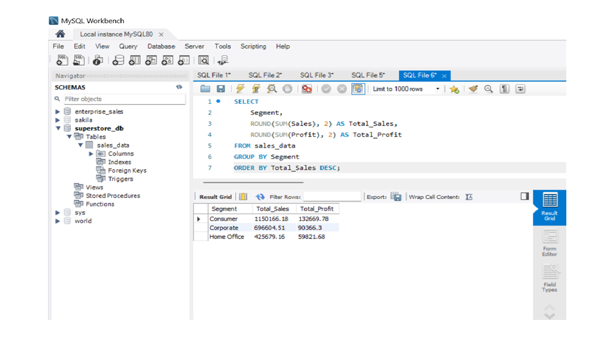

# 📊 Superstore Sales Analysis using SQL (MySQL)

## 📌 Project Overview

This project analyzes the Superstore retail dataset using MySQL to uncover meaningful business insights. The analysis focuses on sales performance, profitability, customer behavior, regional performance, product trends, and customer segmentation.

The project demonstrates SQL skills commonly used by Data Analysts to transform raw business data into actionable insights.

---

## 🎯 Project Objectives

- Analyze overall business performance
- Identify the most profitable regions and categories
- Discover top customers and best-selling products
- Evaluate sub-category profitability
- Analyze customer segments
- Practice real-world SQL analytical queries

---

## 🛠️ Tools & Technologies

- MySQL Workbench
- SQL
- Visual Studio Code
- Git
- GitHub

---

## 📂 Project Structure

```
Superstore-Sales-Analysis-SQL/
│
├── Dataset/
│   └── Sample - Superstore.csv
│
├── SQL/
│   ├── 01_database_setup.sql
│   ├── 02_business_kpis.sql
│   ├── 03_region_analysis.sql
│   ├── 04_category_analysis.sql
│   ├── 05_customer_analysis.sql
│   ├── 06_product_analysis.sql
│   ├── 07_subcategory_analysis.sql
│   └── 08_segment_analysis.sql
│
├── Screenshots/
│   ├── business_kpis.png
│   ├── region_analysis.png
│   ├── category_analysis.png
│   ├── customer_analysis.png
│   ├── product_analysis.png
│   ├── subcategory_analysis.png
│   └── segment_analysis.png
│
├── README.md
├── LICENSE
└── .gitignore
```

---

## 📊 Business KPIs

- Total Sales
- Total Profit
- Profit Margin
- Total Orders
- Total Customers

---

## 📈 Analysis Performed

- Business KPI Analysis
- Region-wise Sales & Profit Analysis
- Category-wise Sales & Profit Analysis
- Top 10 Customers by Sales
- Top 10 Products by Sales
- Sub-Category Profitability Analysis
- Customer Segment Analysis

---

## 💡 Key Business Insights

- 💻 Technology generated the highest overall sales.
- 🌎 West region achieved the highest revenue and profit.
- 👥 Consumer segment contributed the highest sales.
- 🖨️ Copiers were the most profitable sub-category.
- 📉 Tables generated significant losses despite strong sales.
- ⚠️ Some high-revenue products were unprofitable due to discounts.

---

## 🧠 SQL Concepts Used

- SELECT
- WHERE
- GROUP BY
- ORDER BY
- SUM()
- COUNT()
- DISTINCT
- ROUND()
- LIMIT
- Aggregate Functions

---

# 📸 Query Results

## Business KPIs



---

## Region Analysis



---

## Category Analysis



---

## Customer Analysis



---

## Product Analysis



---

## Sub-Category Analysis



---

## Customer Segment Analysis



---

## 🚀 Future Improvements

- Build an interactive Power BI dashboard.
- Add monthly and yearly sales trend analysis.
- Perform customer lifetime value (CLV) analysis.
- Use Common Table Expressions (CTEs).
- Implement Window Functions for advanced analytics.
- Optimize queries using indexes.

---

## 📚 Dataset

**Source:** Sample Superstore Dataset

This dataset contains retail sales transactions including customer information, product details, sales, discounts, and profit.

---

## 👨‍💻 Author

**Shubham Dharwat**

Aspiring Data Analyst

### Skills

- SQL
- MySQL
- Power BI
- Excel
- Python
- Data Visualization
- Business Analytics

---

⭐ If you found this project useful, consider giving it a star!